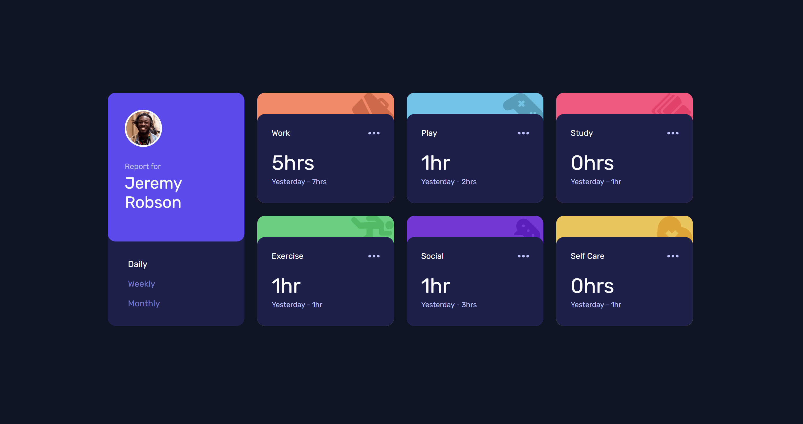

# Frontend Mentor - Time tracking dashboard solution

This is a solution to the [Time tracking dashboard challenge on Frontend Mentor](https://www.frontendmentor.io/challenges/time-tracking-dashboard-UIQ7167Jw).  
Frontend Mentor challenges help you improve your coding skills by building realistic projects.

## Table of contents

- [Overview](#overview)
  - [The challenge](#the-challenge)
  - [Screenshot](#screenshot)
  - [Links](#links)
- [My process](#my-process)
  - [Built with](#built-with)
  - [What I learned](#what-i-learned)
  - [Continued development](#continued-development)
- [Author](#author)

---

## Overview

### The challenge

Users should be able to:

- View the optimal layout for the site depending on their device's screen size
- See hover states for all interactive elements on the page
- Switch between viewing Daily, Weekly, and Monthly stats

---

### Screenshot

---

### Links

- Solution URL: [https://www.frontendmentor.io/solutions/time-tracking-dashboard-using-css-grid-and-json-0HiR5VW77D](https://www.frontendmentor.io/solutions/time-tracking-dashboard-using-css-grid-and-json-0HiR5VW77D)
- Live Site URL: [https://edoardozampini.github.io/time-tracking-dashboard/](https://edoardozampini.github.io/time-tracking-dashboard/)

---

## My process

### Built with

- Semantic HTML5
- CSS custom properties
- CSS Grid
- Flexbox
- Mobile-first workflow
- Vanilla JavaScript
- Fetch API
- CSS transitions and transforms

---

### What I learned

This project helped me consolidate several important frontend concepts:

- How to refactor repetitive JavaScript code using arrays and `forEach`
- How to manage UI state (active buttons and selected timeframe)
- How CSS inheritance works and why child elements don’t always inherit styles
- How to create advanced hover animations using `transform`, `opacity` and pseudo-elements
- How to use CSS variables to build scalable and reusable animations

One part I’m particularly proud of is the hover “swap” animation, where the colored card behind visually comes forward while the inner card moves back:

css
.card:hover::before {
  opacity: 1;
  transform: translateY(0) scale(1);
}

.card:hover .card__inner {
  transform: translateY(12px) scale(0.98);
}

### Continued development

In future projects, I’d like to:

- Improve accessibility (ARIA states, keyboard navigation)
- Refine animation timing and easing for a more polished feel
- Apply similar interaction patterns in larger, more complex dashboards

## Author

- Website: [Schima](https://schima.it/)
- Frontend Mentor: https://www.frontendmentor.io/profile/edoardozampini
- GitHub: https://github.com/edoardozampini